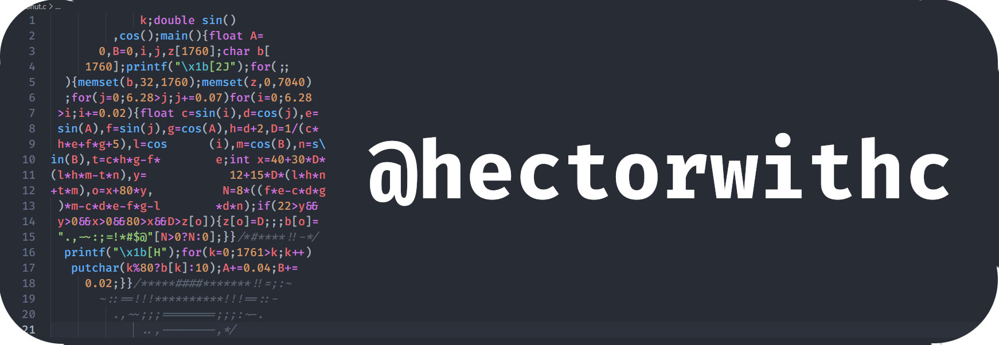

- 👋 Hello, I’m @hectorwithc
- 👀 I’m interested in coding...
- 🪧 This is just a placeholder for now...
- 🌎 In the future I'm looking to work for tech companies...
- 📫 In the future you will be able to reach me at linkedin...

## Programming languages

## Technologies

