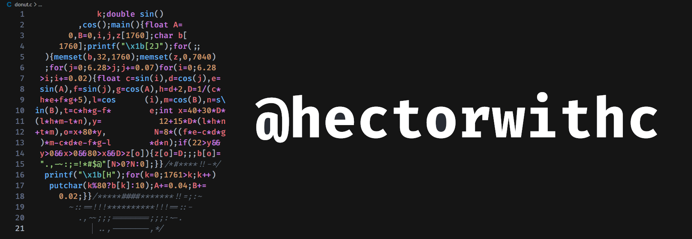

- 👋 Hello, I’m @hectorwithc
- 👀 I’m interested in coding...
- 🌱 This is just a placeholder for now...
- 💭 In the future I'm looking to work for tech companies...
- 📫 In the future you will be able to reach me at linkedin...

<!---
hectorwithc/hectorwithc is a ✨ special ✨ repository because its `README.md` (this file) appears on your GitHub profile.
You can click the Preview link to take a look at your changes.
--->
